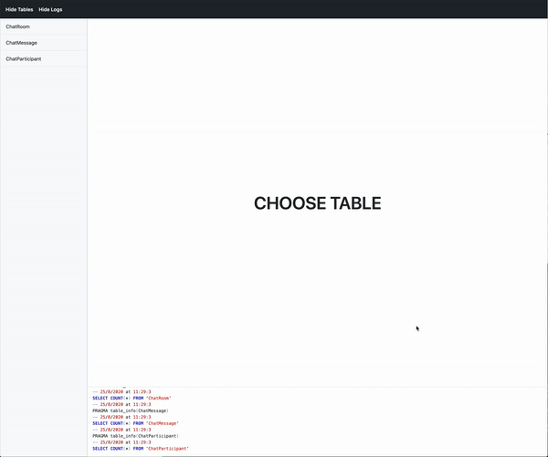

[](https://github.com/BiAtoms/SQLite.viewer)
[](https://cocoapods.org/pods/SQLite.viewer)

# SQLite.viewer

An elegant library for viewing, editing, or debugging sqlite databases in iOS applications.



## Features

* List available databases
* List tables
* Order, Limit, Offset, Filter

## ToDo

- [ ] Inserting rows
- [ ] Editing rows
- [ ] Deleting rows


## Usage

In AppDelegate.swift file, just start `SQLiteViewer`.
```swift
import UIKit
import SQLiteViewer

@UIApplicationMain
class AppDelegate: UIResponder, UIApplicationDelegate {

    var window: UIWindow?


    func application(_ application: UIApplication, didFinishLaunchingWithOptions launchOptions: [UIApplicationLaunchOptionsKey: Any]?) -> Bool {
        
        // port: UInt16 - default is 8081
        // databases: Array of full path to each database
        SQLiteViewer.shared.start(port: 9000, databases: [pathToDatabase])
        return true
    }
}
```

## Installation

### CocoaPods

[CocoaPods](http://cocoapods.org) is a dependency manager for Cocoa projects. You can install it with the following command:

```bash
$ gem install cocoapods
```

To integrate SQLite.viewer into your Xcode project using CocoaPods, specify it in your `Podfile`:

```ruby
source 'https://github.com/CocoaPods/Specs.git'
  target '<Your Target Name>' do
  pod 'SQLite.viewer', git: "https://github.com/sergeymild/SQLite.viewer", configurations: ['Debug']
end
```

Then, run the following command:

```bash
$ pod install
```

## Authors

* **Sergey Mild** - *Initial work* - [SergeyMild](https://github.com/sergeymild)

## License

This project is licensed under the MIT License - see the [LICENSE](LICENSE) file for details
